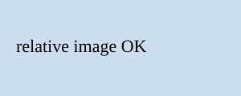
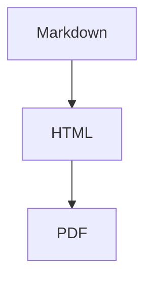

<div class="cover-frame"><div class="title-panel">
<div class="cover-system-name">サンプルシステム</div>
<div class="cover-title">md2pdf 動作確認</div>
<div class="cover-date">2026-10-05</div>
</div></div>

<div style="page-break-after: always;"></div>

# 1. はじめに

本文のサンプルです。日本語の表示と**太字**、`インラインコード`を確認します。

## 1.1 箇条書き

- 項目A
- 項目B
  - 子項目

1. 手順1
2. 手順2

### 1.1.1 表

| 名前 | 値 | 備考 |
|------|----|------|
| alpha | 1 | テスト |
| beta | 2 | テスト |

#### コード

```js
function hello() {
  console.log("hello");
}
```

> 引用文のサンプル

## 1.2 画像（相対パス）



## 1.3 mermaid


